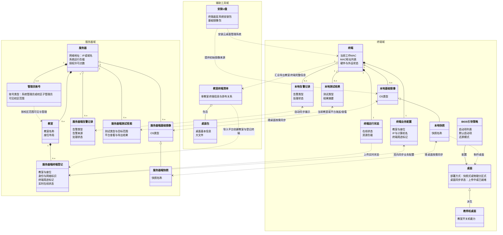

# 云桌面业务对象关系图

> 文档日期：2026-03-24

## 目录

1. [图示说明](#diagram-notes)
2. [业务对象关系图](#diagram)

## 图示说明

- 本版为简化阅读版，优先呈现主业务对象与主数据流转。
- 教师终端与学生终端共用同一终端模型，通过终端用途标记区分。
- 基础镜像与快照随桌面按需同步。
- 交付测试可由临时母机当前教室界面或服务器平台发起，测试结果与告警自动同步。
- 更细的字段说明与机制解释，请结合 [云桌面业务对象关系图-20260323.md](云桌面业务对象关系图-20260323.md) 和 PRD 正文阅读。

## 业务对象关系图

