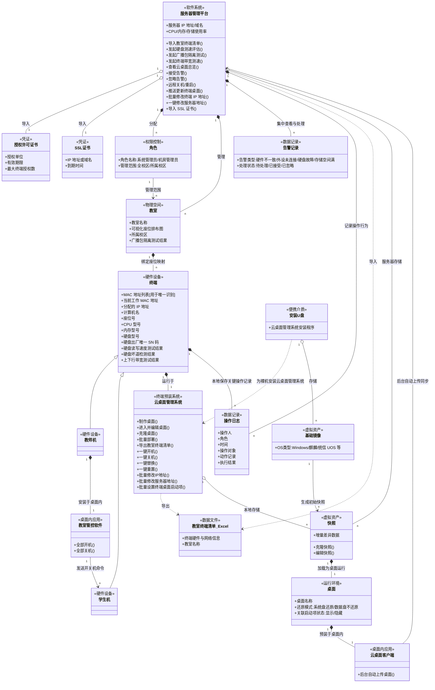

# 云桌面业务对象关系图

```mermaid
classDiagram
    class 服务器管理平台 {
        <<软件系统>>
        +服务器 IP 地址/域名
        +CPU/内存/存储使用率
        +导入教室终端清单()
        +发起硬盘测速评估()
        +发起广播包隔离测试()
        +发起终端带宽测速()
        +查看云桌面总览()
        +接受告警()
        +忽略告警()
        +远程关机/重启()
        +推送更新终端桌面()
        +批量修改终端 IP 地址()
        +一键修改服务器地址()
        +导入 SSL 证书()
    }

    class 授权许可证书 {
        <<凭证>>
        +授权单位
        +有效期限
        +最大终端授权数
    }

    class SSL 证书 {
        <<凭证>>
        +IP 地址或域名
        +到期时间
    }

    class 角色 {
        <<权限控制>>
        +角色名称:系统管理员/机房管理员
        +管理范围:全校区/所属校区
    }

    class 教室 {
        <<物理空间>>
        +教室名称
        +可视化座位排布图
        +所属校区
        +广播包隔离测试结果
    }

    class 终端 {
        <<硬件设备>>
        +MAC 地址列表[用于唯一识别]
        +当前工作 MAC 地址
        +分配的 IP 地址
        +计算机名
        +座位号
        +CPU 型号
        +内存型号
        +硬盘型号
        +硬盘出厂唯一 SN 码
        +硬盘读写速度测试结果
        +硬盘坏道检测结果
        +上下行带宽测试结果
    }

    class 云桌面管理系统 {
        <<终端预装系统>>
        +制作桌面()
        +进入并编辑桌面()
        +克隆桌面()
        +批量部署()
        +导出教室终端清单()
        +一键开机()
        +一键关机()
        +一键替换()
        +一键重置()
        +批量修改IP地址()
        +批量修改服务器地址()
        +批量设置终端桌面启动项()
    }

    class 云桌面客户端 {
        <<桌面内应用>>
        +后台自动上传桌面()
    }

    class 安装U盘 {
        <<便携介质>>
        +云桌面管理系统安装程序
    }

    class 基础镜像 {
        <<虚拟资产>>
        +OS类型:Windows/麒麟/统信 UOS 等
    }

    class 快照 {
        <<虚拟资产>>
        +增量差异数据
        +克隆快照()
        +编辑快照()
    }

    class 桌面 {
        <<运行环境>>
        +桌面名称
        +还原模式:系统盘还原/数据盘不还原
        +关联启动项状态:显示/隐藏
    }

    class 教师机 {
        <<硬件设备>>
    }

    class 学生机 {
        <<硬件设备>>
    }

    class 教室管控软件 {
        <<桌面内应用>>
        +全部开机()
        +全部关机()
    }

    class 教室终端清单_Excel {
        <<数据文件>>
        +终端硬件与网络信息
        +教室名称
    }

    class 告警记录 {
        <<数据记录>>
        +告警类型:硬件不一致/外设未连接/硬盘故障/存储空间满
        +处理状态:待处理/已接受/已忽略
    }

    class 操作日志 {
        <<数据记录>>
        +操作人
        +角色
        +时间
        +操作对象
        +动作记录
        +执行结果
    }

    %% 关系连线 %%
    服务器管理平台 "1" o-- "1" 授权许可证书 : 导入
    服务器管理平台 "1" o-- "1" SSL证书 : 导入
    服务器管理平台 "1" *-- "n" 角色 : 分配
    服务器管理平台 "1" *-- "n" 教室 : 管理
    服务器管理平台 "1" *-- "n" 告警记录 : 集中查看与处理
    服务器管理平台 "1" *-- "n" 操作日志 : 记录操作行为

    角色 "1" --> "n" 教室 : 管理范围

    教室 "1" *-- "n" 终端 : 绑定座位映射
    服务器管理平台 ..> 教室终端清单_Excel : 导入

    终端 <|-- 教师机
    终端 <|-- 学生机
    终端 "1" *-- "1" 云桌面管理系统 : 运行于
    终端 "1" *-- "n" 操作日志 : 本地保存关键操作记录
    云桌面管理系统 ..> 教室终端清单_Excel : 导出

    安装U盘 ..> 云桌面管理系统 : 为裸机安装云桌面管理系统
    安装U盘 "1" o-- "n" 基础镜像 : 存储

    基础镜像 "1" --> "n" 快照 : 生成初始快照
    快照 "1" *-- "1" 桌面 : 加载为桌面运行

    云桌面管理系统 "1" o-- "n" 快照 : 本地存储
    服务器管理平台 "1" o-- "n" 快照 : 服务器存储

    桌面 "1" *-- "1" 云桌面客户端 : 预装于桌面内
    云桌面客户端 --> 服务器管理平台 : 后台自动上传同步

    教师机 "1" *-- "1" 教室管控软件 : 安装于桌面内
    教室管控软件 "1" --> "n" 学生机 : 发送开关机命令
```
