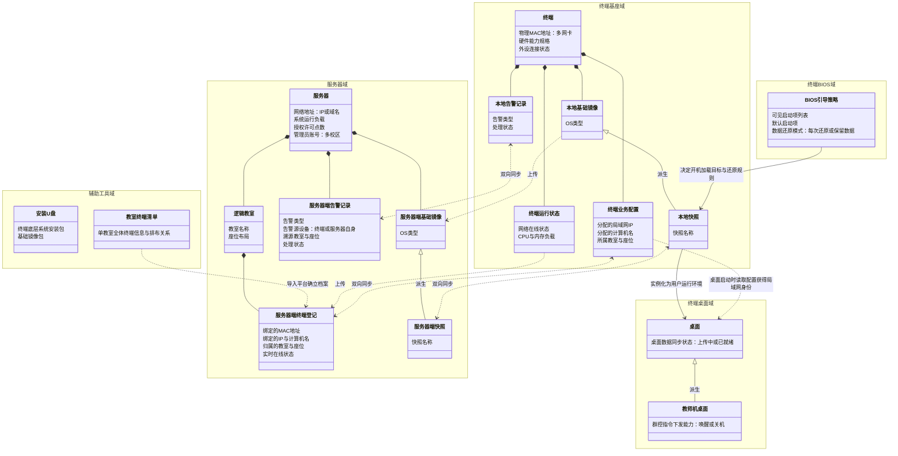

# 云桌面业务对象关系图

> **设计思想复盘**：
> 1. **严守“高效沟通原则”与“分模块定接口”**：彻底删除了域内部用于表达包含、组合的“蜘蛛网”连线。实体的归属由 `namespace` 天然划分，连线仅用于表达**跨域的业务数据流转**与核心生命周期接口，极大提升了图表的沟通效率。
> 2. **去除歧义词与过度抽象**：去除了“云档案”这种容易与公有云混淆的词汇，改回“服务器端终端登记”；去除了快照实体中属于底层实现细节的“差异数据包”。
> 3. **理顺继承与业务能力**：“教师机桌面”本质上也是一种桌面，它天然拥有普通桌面的所有业务能力（如数据同步），在此基础上额外叠加了群控业务。因此采用继承（派生）关系来表达，准确切中业务逻辑。

