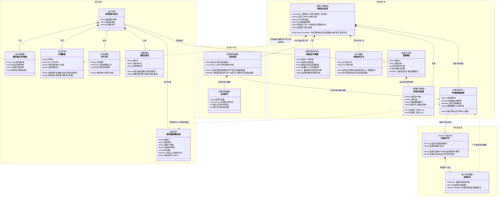

# 云桌面业务对象关系图 (按域划分版)

> 本图基于脱机部署架构与底层 Electron 图形界面能力构建，重点关注各业务域中对象所承载的数据与属性，指导后续功能边界设计与交互数据流转。

```mermaid
classDiagram
    %% ================= 服务器域 =================
    namespace 服务器域 {
        class 服务器基本信息 {
            <<业务实体>>
            +String 服务器IP地址
            +String 绑定的域名
            +String 系统版本号
        }

        class 服务器运行时数据 {
            <<运行态数据>>
            +Float CPU总体使用率
            +Float 内存总体使用率
            +Float 存储空间使用率
            +String 服务运行健康状态
        }

        class 告警数据 {
            <<业务实体>>
            +String 告警ID
            +String 告警类型(如:硬盘SN码变更/外设断开)
            +DateTime 产生时间
            +String 关联的终端MAC地址
            +String 关联的教室ID
            +String 处理状态(待处理/已解决/已忽略)
        }

        class 服务器端镜像快照 {
            <<虚拟资产>>
            +String 快照ID
            +String 快照名称
            +String 基础OS类型
            +String 存储绝对路径
            +Long 文件体积
            +DateTime 最后上传/修改时间
            +String 来源终端工作MAC
        }

        class 许可证书 {
            <<凭证数据>>
            +String 证书编号
            +String 授权单位(学校/企业名)
            +DateTime 有效期限截止日
            +Int 最大并发终端授权数
        }

        class 管理员账号 {
            <<权限控制>>
            +String 账号ID
            +String 登录用户名
            +String 密码散列值
            +String 角色(系统管理员/机房管理员)
            +String 管理范围边界(全校区/特定教室)
        }
    }

    %% ================= 终端服务域 =================
    namespace 终端服务域 {
        class 终端基本信息 {
            <<硬件实体数据>>
            +List~String~ 物理MAC地址列表[唯一标识源]
            +String 当前工作MAC地址[主键]
            +String CPU型号描述
            +String 内存容量及规格
            +String 硬盘出厂唯一SN码[核心防替换标识]
            +String 硬盘型号及总容量
            +Map~String, Boolean~ 外设连接状态(显示器/键盘/鼠标等-仅记录有无)
        }

        class 终端分配配置 {
            <<逻辑赋予数据>>
            +String 分配的IP地址
            +String 计算机名
            +String 所属逻辑教室ID
            +Int 行列矩阵_行号(Row)
            +Int 行列矩阵_列号(Col)
            +String 绑定的上级服务器IP
        }

        class 终端运行时数据 {
            <<底层系统运行态>>
            +Float 底层CPU使用率
            +Float 底层内存使用率
            +Float 硬盘实时读写测速结果
            +Float 局域网上下行测速结果
            +String 广播包隔离环境测试结果
            +String 底层网络联机/脱机状态
        }

        class 终端操作日志 {
            <<审计数据>>
            +String 日志流水号
            +DateTime 发生时间
            +String 操作动作(脱机克隆/恢复默认/一键重置等)
            +String 执行结果状态(成功/失败及原因)
        }

        class 终端端镜像快照 {
            <<本地虚拟资产>>
            +String 本地快照ID
            +String 展示名称(交互中称为"桌面")
            +String 本地磁盘挂载路径
            +Boolean 是否为基础母盘
            +String 增量数据Hash特征值
        }

        class 逻辑教室 {
            <<弱业务实体>>
            +String 教室ID
            +String 教室名称
            +Int 座位矩阵总行数
            +Int 座位矩阵总列数
            +Boolean 当前是否处于脱机部署模式
        }
    }

    %% ================= 终端BIOS域 =================
    namespace 终端BIOS域 {
        class 启动菜单 {
            <<界面渲染数据>>
            +String 菜单主标题
            +List~String~ 菜单展示项列表
            +Int 默认高亮选中项索引
            +Int 倒计时自动启动秒数
        }

        class 启动配置 {
            <<轻量控制数据>>
            +String 默认引导的本地快照ID
            +List~String~ 允许引导的快照ID列表
            +String 全局还原模式策略(每次开机还原/保留数据)
            +Boolean 离线脱机启动开关(True表示不连网也可直接进桌面)
        }
    }

    %% ================= 终端桌面域 =================
    namespace 终端桌面域 {
        class 桌面运行时 {
            <<Guest OS运行态>>
            +String 正在运行的底层快照ID
            +String 桌面内网络IP地址
            +String 桌面内当前MAC地址(虚拟或网卡透传)
            +String 系统运行状态(运行中/待机/冻结)
        }

        class 桌面会话 {
            <<用户交互数据>>
            +DateTime 桌面环境启动时间
            +String 当前登录系统账户
            +Boolean 存在未上传服务器的差异数据标记
        }
    }

    %% ================= 关系连线 =================
    服务器基本信息 "1" *-- "1" 服务器运行时数据 : 产生
    服务器基本信息 "1" o-- "n" 许可证书 : 校验
    服务器基本信息 "1" *-- "n" 管理员账号 : 归属
    服务器基本信息 "1" *-- "n" 告警数据 : 汇聚
    服务器基本信息 "1" o-- "n" 服务器端镜像快照 : 集中存储

    服务器基本信息 "1" -- "n" 逻辑教室 : 逻辑纳管
    逻辑教室 "1" *-- "n" 终端分配配置 : 包含座位矩阵映射

    终端基本信息 "1" *-- "1" 终端分配配置 : 承载
    终端基本信息 "1" *-- "1" 终端运行时数据 : 产生
    终端基本信息 "1" *-- "n" 终端操作日志 : 记录本地行为
    终端基本信息 "1" *-- "n" 终端端镜像快照 : 驻留本地磁盘

    终端基本信息 "1" ..> "1" 告警数据 : 异常触发(如硬盘SN变化/外设掉线)
    终端端镜像快照 "n" <..> "1" 服务器端镜像快照 : 联机同步(上传/推送更新)

    终端基本信息 "1" *-- "1" 启动配置 : 决定设备如何引导
    启动配置 "1" *-- "1" 启动菜单 : 提供渲染元数据
    启动配置 "1" --> "n" 终端端镜像快照 : 引用本地存储的桌面

    终端端镜像快照 "1" --> "1" 桌面运行时 : 加载为活动系统
    桌面运行时 "1" *-- "1" 桌面会话 : 承载用户活动
    桌面会话 "1" ..> "1" 终端端镜像快照 : 产生增量差异数据
```
