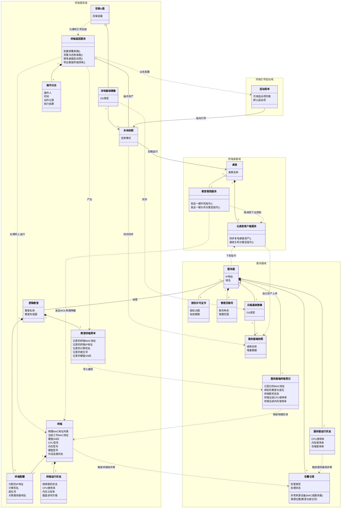
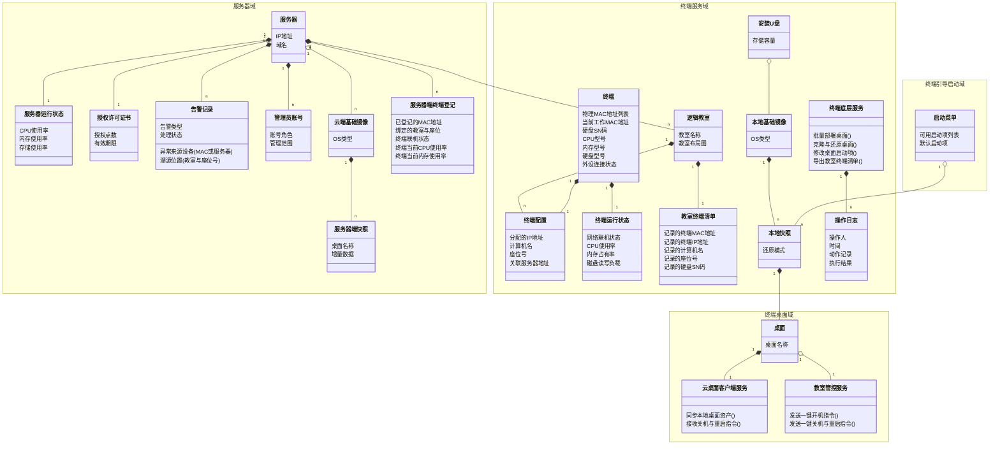

# 云桌面业务对象关系图

> 本图基于产品经理的纯粹业务视角重构。剥离了技术实现细节（如文件格式、进度条）与非核心层级（如临时测试数据），将聚光灯打在**核心业务实体（终端、教室、镜像、快照、桌面、服务器）** 上，并通过更准确的依赖与从属关系，讲清楚“系统在为谁服务”、“数据从哪里来，要到哪里去”。

---

---

## 版本二：沟通效率 MAX 极简版 (纯粹聚焦拆分与归属)

> 过滤了跨域的虚线依赖和业务动作流转，只保留业务对象的**组合(*--)**与**聚合(o--)**关系。让人第一眼看清：整个业务盘子里到底有哪几个实体，实体下面挂着什么数据，服务归属于谁。

