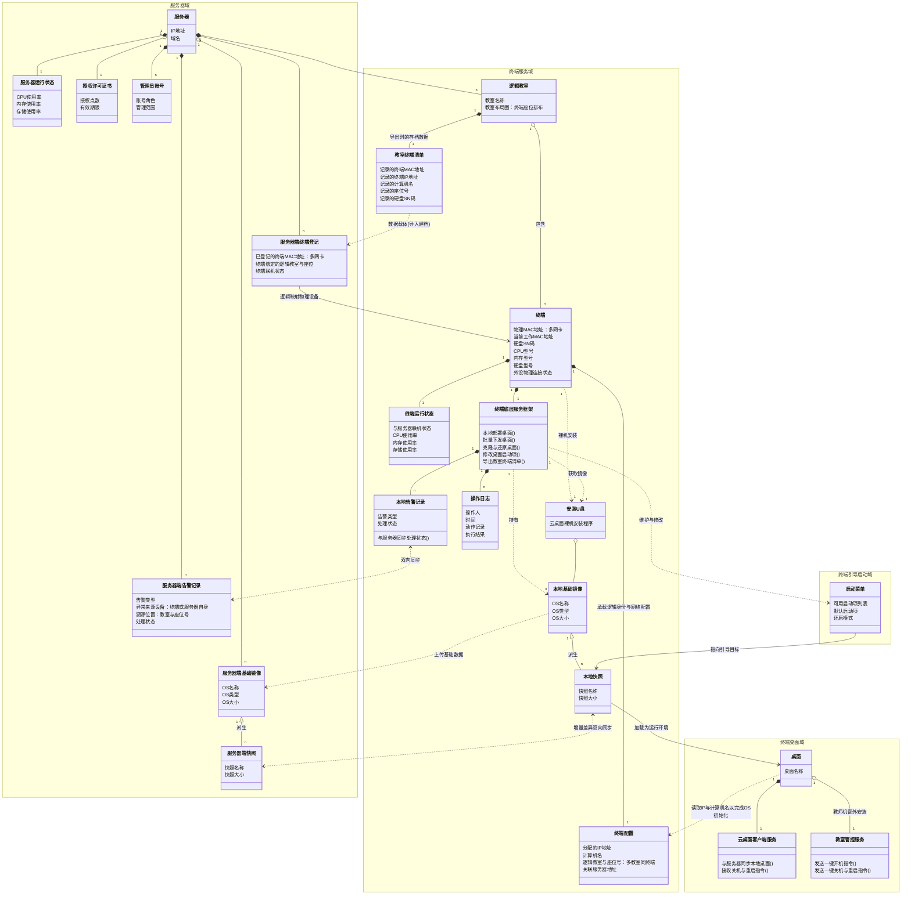

# 云桌面业务对象关系图 v5

> **版本说明 (v5)**：
> 1. **深度洞察“逻辑教室”**：引入聚合关系（`o--`）代替组合关系（`*--`）连接教室与终端。这在架构上完美支撑了“同一个物理终端可以既属于小班教室，又属于合班大教室”的物理位置重叠场景。
> 2. **克制而精准的连线**：去掉了零碎的操作动作连线，保留了最核心的**资产流转**（镜像->快照衍生、本地<->服务器双向同步）和**逻辑映射**（清单转登记、登记映射物理机）。

