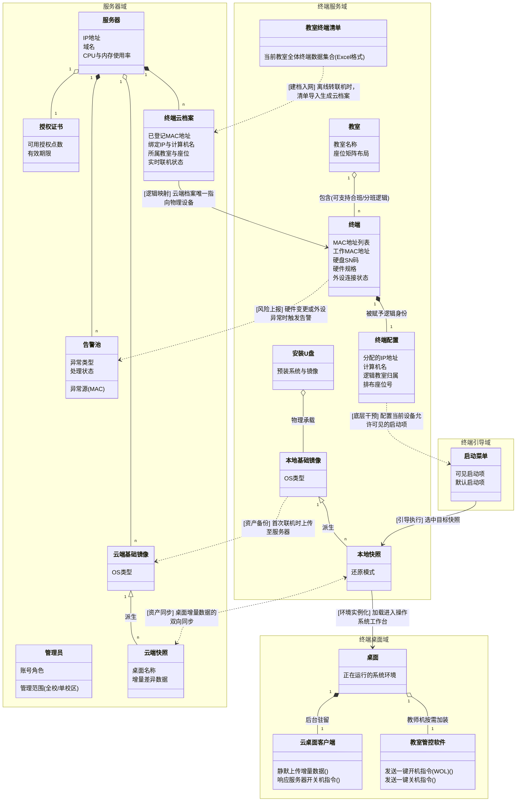

# 云桌面业务对象关系图 v6

> 本文档是一份完整的产品业务对象架构蓝图。采用“划模块，定接口”的自顶向下推演逻辑，将系统划分为四大核心业务域。图中的实体均采用日常沟通中真实存在的业务概念（如：终端、桌面、镜像、教室），摒弃了生硬的系统架构概括词。关系连线侧重于表达域内核心实体的归属，以及跨域的业务数据流转协同。

```mermaid
classDiagram
    %% ================= 服务器域 =================
    namespace 服务器域 {
        class 服务器 {
            IP地址
            域名
            CPU与内存使用率
        }
        class 授权证书 {
            可用授权点数
            有效期限
        }
        class 管理员 {
            账号角色
            管理范围(全校/单校区)
        }
        class 终端云档案 {
            已登记MAC地址
            绑定IP与计算机名
            所属教室与座位
            实时联机状态
        }
        class 告警池 {
            异常类型
            异常源(MAC)
            处理状态
        }
        class 云端基础镜像 {
            OS类型
        }
        class 云端快照 {
            桌面名称
            增量差异数据
        }
    }

    %% ================= 终端服务域 =================
    namespace 终端服务域 {
        class 终端 {
            MAC地址列表
            工作MAC地址
            硬盘SN码
            硬件规格
            外设连接状态
        }
        class 终端配置 {
            分配的IP地址
            计算机名
            逻辑教室归属
            排布座位号
        }
        class 教室 {
            教室名称
            座位矩阵布局
        }
        class 教室终端清单 {
            当前教室全体终端数据集合(Excel格式)
        }
        class 安装U盘 {
            预装系统与镜像
        }
        class 本地基础镜像 {
            OS类型
        }
        class 本地快照 {
            还原模式
        }
    }

    %% ================= 终端引导域 =================
    namespace 终端引导域 {
        class 启动菜单 {
            可见启动项
            默认启动项
        }
    }

    %% ================= 终端桌面域 =================
    namespace 终端桌面域 {
        class 桌面 {
            正在运行的系统环境
        }
        class 云桌面客户端 {
            静默上传增量数据()
            响应服务器开关机指令()
        }
        class 教室管控软件 {
            发送一键开机指令(WOL)()
            发送一键关机指令()
        }
    }

    %% ================= 业务关系与跨域接口 =================

    %% 域内核心关系 (不追求全互联，只体现核心归属与派生)
    服务器 "1" o-- "1" 授权证书
    服务器 "1" *-- "n" 终端云档案
    服务器 "1" *-- "n" 告警池
    服务器 "1" o-- "n" 云端基础镜像
    云端基础镜像 "1" <|-- "n" 云端快照 : 派生

    教室 "1" o-- "n" 终端 : 包含(可支持合班/分班逻辑)
    终端 "1" *-- "1" 终端配置 : 被赋予逻辑身份

    安装U盘 o-- 本地基础镜像 : 物理承载
    本地基础镜像 "1" <|-- "n" 本地快照 : 派生

    桌面 "1" *-- "1" 云桌面客户端 : 后台驻留
    桌面 "1" o-- "1" 教室管控软件 : 教师机按需加装

    %% 跨域核心接口 (数据流转与业务协同)
    教室终端清单 ..> 终端云档案 : [建档入网] 离线转联机时，清单导入生成云档案
    终端云档案 --> 终端 : [逻辑映射] 云端档案唯一指向物理设备

    终端 ..> 告警池 : [风险上报] 硬件变更或外设异常时触发告警

    本地基础镜像 ..> 云端基础镜像 : [资产备份] 首次联机时上传至服务器
    本地快照 <..> 云端快照 : [资产同步] 桌面增量数据的双向同步

    终端配置 ..> 启动菜单 : [底层干预] 配置当前设备允许可见的启动项
    启动菜单 --> 本地快照 : [引导执行] 选中目标快照
    本地快照 --> 桌面 : [环境实例化] 加载进入操作系统工作台
```
