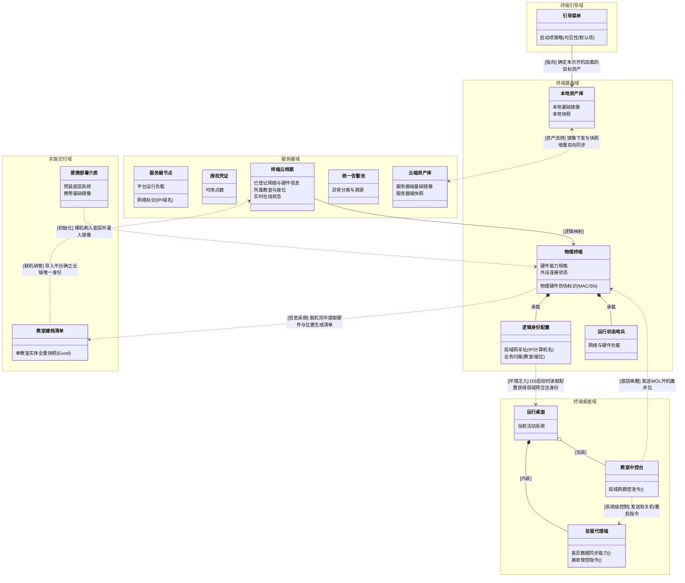

# 云桌面业务对象关系图 v7 (PM 深度推演版)

> **版本说明 (v7)**：
> 这一次，我们不再是为了“精简”而精简，而是为了“精准表达业务逻辑”而重构。
> 1. **独立出「实施交付域」**：深刻理解了“安装U盘”与“终端”的生命周期差异。U盘和《教室终端清单》本质上是脱机实施阶段的“摆渡工具”和“交付产物”，它们不应永远挂载在终端基座上，因此为其单独划域。
> 2. **实体拆分的“为什么”**：
>    - 终端的「逻辑身份配置」与「运行状态」必须拆开。因为配置（IP/计算机名）是需要被上层 Guest OS（桌面）读取注入的，而状态（CPU负载）只是为了上报。它们的业务消费方和数据流转方向完全不同。
>    - 服务器的「节点配置」与「运行状态」合并。因为在产品早期规划中，服务器作为中心节点，其自身的软硬件拆分并不驱动跨域的核心业务逻辑流转，过度拆分反而增加认知负担。
> 3. **淡化“服务”，聚焦“能力”**：早期不急于定性“XX服务”部署在哪，而是看实体是否具有某种业务能力（如桌面里的驻留代理端负责同步和听令）。

