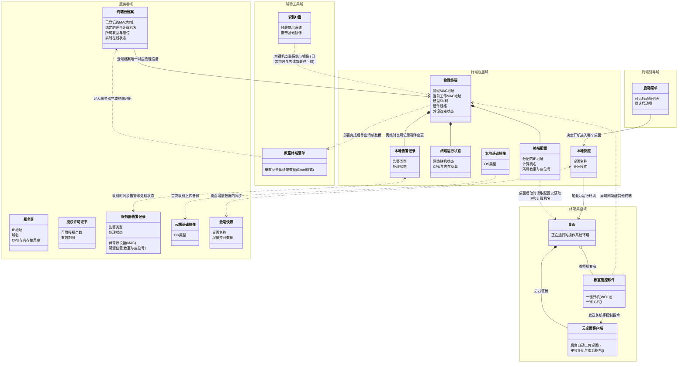

# 云桌面业务对象关系图

> **设计思想**：
> 1. **拒绝 AI 式的过度抽象**：坚决摒弃“信息采撷”、“环境注入”等生造的总结性黑话，回归人类产品经理日常沟通的自然语言（如“导出”、“读取”、“安装U盘”），让人一看就懂。
> 2. **孤岛间的业务探讨价值**：在终端底层域引入了`本地告警记录`。它与服务器的告警池看似重叠，实则是为了支撑“脱机断网状态下终端依然能发现硬件被拔插”的业务场景。图上画出这两个独立的实体，天然就能在会议中引发“这两端告警如何同步、由谁处理”的业务探讨。
> 3. **工具生命周期的重定位**：将“安装U盘”从“一次性交付域”改为了更宽泛的“辅助工具域”。因为它不仅用于初始安装，在后续加装软件、部署纯净考试环境时依然会被拔插使用，它是一个贯穿业务周期的实体工具。

