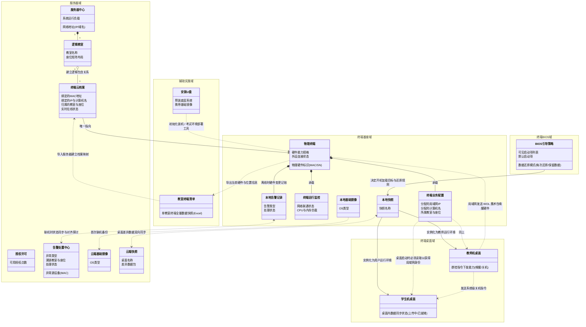

# 云桌面业务对象关系图 (PM 终极业务推演版)

> **设计思想复盘**：
> 1. **回归最纯粹的业务实体**：彻底删除了“云桌面客户端”、“管控软件”等软件部署层面的服务壳子。将其业务能力还原给真正的业务实体——“学生机桌面”拥有同步状态，“教师机桌面”拥有群控能力。
> 2. **实体拆分的生命周期逻辑**：为什么终端要拆出“物理终端”、“终端业务配置”、“终端运行监控”？因为它们的生命周期和流转方向完全不同：物理硬件是天生的（只读上报），配置是服务器赋予并供桌面OS消费的（注入），监控状态是实时变化用于看板展示的。同理，服务器由于是中心黑盒，其配置与负载合并即可，无需过度设计。
> 3. **找回丢失的核心拼图**：重新引入了“逻辑教室”作为服务器域的核心统筹实体；将“启动菜单”明确为“BIOS引导策略”，并补齐了核心业务属性“数据还原模式”。
> 4. **隔离“辅助实施域”**：明确“安装U盘”和“终端清单”的工具人属性，它们穿插于初始化部署、考试环境搭建等特定环节，而非终端基座的固有组件。

