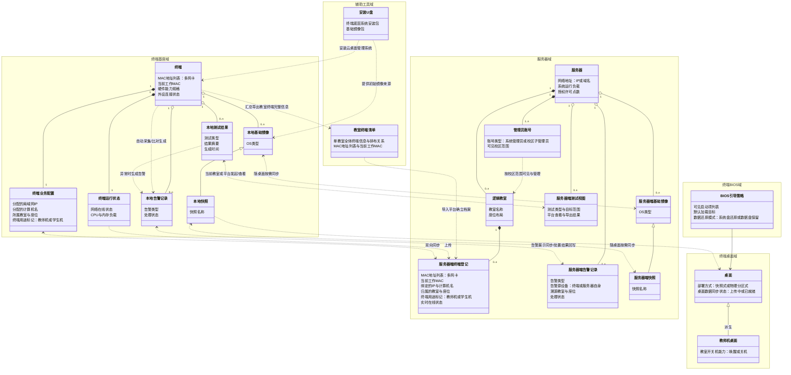

# 云桌面业务对象关系图 v11

> **文档日期**：2026-03-23
> **说明**：本文件为探索推演稿，用于记录概念边界与关系取舍。
> **本版推演要点**：
> 1. **角色与账号分离**：线下服务人员不是平台权限对象，平台中的权限载体是“管理员账号”。管理员账号分为系统管理员账号与校区子管理员账号，能力集基本一致，差别主要在可见范围。
> 2. **镜像/快照同步改为“按需双向”**：终端或服务器在初始建档阶段都可能还没有任何桌面资产，因此基础镜像与快照的同步不能表达成必经的单向上传路径，而应表达为“随桌面按需同步”。
> 3. **教师机以“终端用途标记 + 特殊桌面”表达**：教师机在物理层面仍是普通终端，但在服务器端终端登记和终端业务配置中必须具备明确的教师机标记，并在桌面层叠加教室开关机能力。
> 4. **考试桌面支持物理分区式加载**：桌面并不总是由快照实例化，少数考试桌面可直接由物理分区方式加载，因此“快照 -> 桌面”关系改为“快照式桌面的数据来源”。
> 5. **交付测试是产品内能力**：硬件检测、网络测试与异常展示都不应只被理解为“终端先做、服务器只看结果”，而应支持当前教室入口和服务器平台共同发起、查看与同步。

